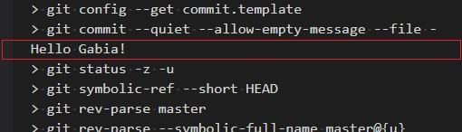
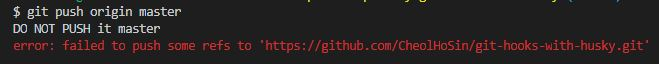
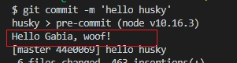
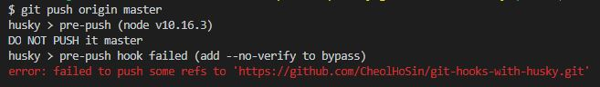

# husky 로 git hook 하자

본 문서는 npm 모듈인 **husky** 를 사용해 **Git Hooks** 를 공유하는 방법을 설명한다.

## 들어가기 앞서

>지키지 않는 정책은 없으니만 못하다.

이 말에 누구나 다 고개를 끄덕이겠지만, 이 세상에 정책을 준수하는 것만큼 어려운 일도 없다.

팀원 모두가 머리를 맞대어 개발 문화와 정책을 논의할 때만 해도 개발 프로세스만 제대로 확립하면 개발에서 테스트, 배포까지 물 흐르듯 흘러가고 세상 모든 에러와 영원히 이별할 수 있으리라 기대한다. 하지만 이 뒤에 우리를 기다리는 건 무수한 고통의 연속이다.

- 코딩 스타일 안 따르기
- 테스트 코드 작성 안하기
- 테스트 실패하기
- 코드 커버리지 낮추기
- master 에 직접 밀어넣기
- 그 밖에 기상천외한 일들...

코드 리뷰를 할 때마다 매번 지켜지지 않은 정책들을 나열하면서 왜 정책을 지켜야 하는지에 대해 장황한 설명을 할 수도 없는 노릇이고, 결국 사람이 하는 일이라 고의로든 실수로든 정책을 부분 부분 빠뜨리고 만다.

그렇다면 정책을 강제할 수 있는 방법은 없을까? master 에 직접 밀어넣으려고 하면 작업을 중단해버리고 MR을 사용하라고 메세지를 띄워주는 마법 같은 방법 말이다.

다행히도 이에 대해 고민했던 수많은 선구자가 있었고, 조금 검색해보는 것만으로도 유용한 방법들을 어렵지 않게 찾을 수 있다.

다양한 방법이 있지만, 만일 팀이 Git 을 사용하고 있다면 **Git Hooks** 를 활용하여 쉽고 간단하게 정책을 강제할 수 있다.

## Git Hooks

### Git Hooks 란?

**Git Hooks** 는 Git 과 관련한 어떤 이벤트가 발생했을 때 특정 스크립트를 실행할 수 있도록 하는 기능이다. 크게 **클라이언트 훅** 과 **서버 훅** 으로 나뉘는데 **클라이언트 훅** 은 커밋, Merge 가 발생하거나 push 가 발생하기 전 클라이언트에서 실행하는 훅이다. 반면 **서버 훅** 은 Git repository 로 push 가 발생했을 때 서버에서 실행하는 훅이다.

우리가 사용할 것은 이 중 **클라이언트 훅** 이다.

> 만약 Git Repository 서버를 관리할 수 있는 권한이 있다면 **서버 훅** 을 활용하는 게 더 유용할 수 있다. Git Repository 서버에 있는 모든 프로젝트에 대해 push 정책을 설정할 수 있기 때문이다.

**클라이언트 훅** 은 **커밋 워크플로 훅**, **이메일 워크플로 훅**, 그리고 **기타 훅** 으로 분류할 수 있다.

**커밋 워크플로 훅** 은 `git commit` 명령으로 커밋을 할 때 실행하는 훅이고 **이메일 워크플로 훅** 은 `git am` 명령으로 이메일을 통해 patch 파일을 적용할 때 실행하는 훅이다. **기타 훅** 은 Rebase, Merge, Push 와 같은 이벤트를 실행할 때 실행하는 훅을 포함한다.

분류에 따른 훅은 아래 표와 같다.

<table>
    <colgroup>
        <col><col><col>
    </colgroup>
    <thead>
        <tr>
            <th>분류</th>
            <th>훅</th>
            <th>설명</th>
        </tr>
    </thead>
    <tbody>
        <tr>
            <td rowspan="4">커밋 워크플로 훅</td>
            <td>pre-commit</td>
            <td>commit 을 실행하기 전에 실행</td>
        </tr>
        <tr>
            <td>prepare-commit-msg</td>
            <td>commit 메시지를 생성하고 편집기를 실행하기 전에 실행</td>
        </tr>
        <tr>
            <td>commit-msg</td>
            <td>commit 메시지를 완성한 후 commit 을 최종 완료하기 전에 실행</td>
        </tr>
        <tr>
            <td>post-commit</td>
            <td>commit 을 완료한 후 실행</td>
        </tr>
        <tr>
            <td rowspan="3">이메일 워크플로 훅</td>
            <td>applypatch-msg</td>
            <td>git am 명령 실행 시 가장 먼저 실행</td>
        </tr>
        <tr>
            <td>pre-applypatch</td>
            <td>patch 적용 후 실행하며, patch 를 중단시킬 수 있음</td>
        </tr>
        <tr>
            <td>post-applypatch</td>
            <td>git am 명령에서 마지막으로 실행하며, patch 를 중단시킬 수 없음
        </tr>
        <tr>
            <td rowspan="4">기타 훅</td>
            <td>pre-rebase</td>
            <td>Rebase 하기 전에 실행</td>
        </tr>
        <tr>
            <td>post-rewrite</td>
            <td>git commit --amend, git rebase 와 같이 커밋을 변경하는 명령을 실행한 후 실행</td>
        </tr>
        <tr>
            <td>post-merge</td>
            <td>Merge 가 끝나고 나서 실행</td>
        </tr>
        <tr>
            <td>pre-push</td>
            <td>git push 명령 실행 시 동작하며 리모트 정보를 업데이트 하고 난 후 리모트로 데이터를 전송하기 전에 실행. push 를 중단시킬 수 있음</td>
        </tr>
    </tbody>
</table>


### Git Hooks 를 적용하려면?

`Git Hooks` 는 `.git/hooks` 디렉토리 안에 저장한다. hook 은 실행가능한 스크립트이며, 설정하고자 하는 훅 이름을 확장자 없이 파일명으로 지정하면 `Git Hooks` 를 적용할 수 있다.

예를 들어 **pre-commit** 훅을 적용하여 commit 직전에 *Hello Gabia!* 를 출력하고 싶다면 다음과 같이 파일을 생성하면 된다.

**.git/hooks/pre-commit**
```sh
#!/bin/sh

echo 'Hello Gabia!'

exit 0 # Exit 코드가 0 이 아니면 커밋이 취소됨
```

위 파일을 저장하고 프로젝트에서 커밋을 실행해보자. 아래 그림과 같이 *Hello Gabia!* 를 출력하는 것을 확인할 수 있다.



### master 로 직접 push 방지하기

실제로 유용한 훅을 적용해보자. 원본 프로젝트의 Master 로 직접 Push 하려고 하면 push 를 중단시키는 훅이다.

push 를 실행하는 경우 동작해야 하므로, `pre-push` 훅을 사용하면 된다. `pre-push` 훅은 리모트 이름과 주소를 파라미터로 전달받으며 stdin 을 통해 업데이트할 해시 리스트를 전달받는다. 우리는 리모트 주소와 브랜치명을 조사하여 push 를 통과시키거나 중단시키면 된다.

스크립트는 다음과 같다.

**.git/hooks/pre-push**
```sh
#!/bin/sh

FORBIDDEN_HTTPS_URL="https://github.com/CheolHoSin/git-hooks-study.git" # insert your remote url (https)
FORBIDDEN_SSH_URL="git@github.com:CheolHoSin/git-hooks-study.git" # insert your remote url (ssh)
FORBIDDEN_REF="refs/heads/master" # insert branch ref

remote="$1"
url="$2"

if [ "$url" != "$FORBIDDEN_HTTPS_URL" -a "$url" != "$FORBIDDEN_SSH_URL" ]
then
    exit 0 # Forked Project 에서는 제한하지 않음
fi

if read local_ref local_sha remote_ref remote_sha
then
    if [ "$remote_ref" == "$FORBIDDEN_REF" ]
    then
        echo "DO NOT PUSH it master"
        exit 1 # 금지된 ref 로 push 를 실행하면 에러
    fi
fi

exit 0
```

훅을 적용한 후 원본 프로젝트의 master 로 push 를 시도하면 다음과 같이 에러 메세지와 함께 push 가 실패하는 것을 확인할 수 있다.



### Git Hooks 를 공유하려면?

**Git Hooks** 는 `.git` 디렉토리에 저장한다. 그런데 `.git` 디렉토리는 버전 관리 대상이 아니므로 Repositories 에 올라가지 않는다. 기본적인 Git 체계 하에서는 **Git Hooks** 를 공유할 수 없다는 뜻이다.

**Git Hooks** 를 공유하는 효과적인 방법은 무엇이 있을까? 다양한 방법이 있겠지만 주로 다음과 같은 방법을 사용한다.

1. Git Hooks 를 설정하는 스크립트 공유
1. Git Template 을 활용
1. husky 사용

#### Git Hooks 를 설정하는 스크립트 공유

**방법1. Git Hooks 를 설정하는 스크립트 공유** 는 **Git Hooks** 를 공유하는 방법 중 가장 단순한 접근이다. **Git Hooks** 를 별도 디렉토리에 넣어 버전 관리를 하고, 이 훅을 `.git/hooks` 로 복사하는 스크립트를 함께 공유하는 방식이다.

우선 프로젝트 내에 **githooks** 라는 디렉토리를 만들고 다음과 같이 hooks 를 넣어둔다.

```
./githooks/
    
    └─ pre-commit
    └─ pre-push
```

그리고 다음 스크립트를 함께 공유한다.

**./setup_hooks.sh**
```sh
#!/bin/sh

cp githoooks/* .git/hooks
```

이 스크립트는 단순히 **githooks** 디렉토리에 있는 모든 파일을 **.git/hooks** 디렉토리로 복사를 할 뿐이다.

이 방법을 사용하면 프로젝트별로 hooks 를 관리하고 공유할 수 있다. 하지만 작업자는 `git clone` 후에 반드시 `./setup_hooks.sh` 를 실행해야 한다. 만일 실수로 (혹은 고의로) 설정 스크립트를 실행하지 않으면 훅을 적용할 수 없다.

#### Git Template 을 활용

**방법2: Git Template 을 활용** 은 `git clone` 시 `--template` 옵션을 통해 `.git` 디렉토리를 초기화할 수 있다는 점을 활용한다.

우선 프로젝트와 독립된 경로에 다음과 같이 Template 디렉토리를 구성하고 **Git Hooks** 를 넣어둔다.

```
/home/uzulove/git_templates/
    
    └─ hooks/
        
        └─ pre-commit
        └─ pre-push
```

그리고 프로젝트를 clone 할 때 `--template` 옵션에 위에서 생성한 Template 디렉토리를 경로로 지정한다.

```bash
$ git clone --template=/home/uzulove/git_templates https://github.com/CheolHoSin/git-hooks-study.git
```

이제 `.git/hooks` 디렉토리를 확인해보면 **Git Hooks** 가 정상적으로 설정돼 있는 걸 확인할 수 있다.

```
.git/hooks/

    └─ pre-commit
    └─ pre-push
```

이 방법은 **Git Hooks** 를 별도 경로 (또는 Repository) 에서 관리하고자 할 때 유용하다. 하지만 Template 을 미리 공유해야 하며, `--template` 옵션을 빠뜨리는 경우 훅을 적용할 수 없다는 문제가 있다.

#### husky 를 사용하자

앞서 설명한 두 가지 방법은 유용하지만 치명적인 문제가 있다. 작업자가 실수로든 고의로든 **Git Hooks** 을 적용하지 않을 가능성이 크다는 것이다.

또한 팀에서만 공유하는 프로젝트가 아니라 불특정다수에게 공개한 프로젝트라면 작업자가 **Git Hooks** 를 적용했는지 관리 감독하기가 더욱 어려워진다.

**Git Hooks** 을 반드시 적용하게끔 강제할 수는 없을까? 만약 프로젝트가 모듈 의존성을 관리하기 위해 npm 을 사용하고 있다면 **husky** 은 좋은 선택이 될 수 있다.

## husky

**husky** 는 **Git Hooks** 를 보다 쉽게 적용할 수 있는 npm 모듈이다. 심지어 **Git Hooks** 에 대해 자세히 알지 못하더라도 commit, push 정책을 관리하고 공유할 수 있다.

**husky** 를 사용하여 commit 실행 전 *Hello Gabia, woof!* 를 출력하는 예제를 만들어보자.

우선 **husky** 를 설치한다.

**husky 설치**
```bash
$ npm install --save-dev husky
```

다음으로 commit 정책을 정의한다. `.huskyrc` 파일에 정의하고자 하는 훅과 실행할 명령어를 지정하면 된다.

> 정책은 `package.json` 에 정의하여도 무방하다. `.huskyrc` 에 정의하는 건 순전히 별도 파일로 관리하고 싶어서이다.

**.huskyrc**
```json
{
    "hooks": {
        "pre-commit": "echo 'Hello Gabia, woof!'"
    }
}
```

이제 commit 을 실행해보자. 아래 그림과 같이 'Hello Gabia!, woof' 를 출력하는 것을 확인할 수 있다.



이 방법을 통해 사용자는 프로젝트별로 commit, push 등 정책을 관리하고 공유할 수 있다. 

또한 작업자가 의존 모듈을 설치하는 것만으로 husky 가 적용된다. 더 이상 설치 스크립트를 실행하지 않거나 옵션을 빠뜨려서 **Git Hooks** 를 적용하지 못하는 상황은 발생하지 않는다.

### husky 동작 방식

단지 모듈을 설치하고 정책을 정의했을 뿐인데 **Git Hooks** 처럼 동작하고 있다. 어떻게 이런 일이 가능할까? **husky** 구조를 살펴보도록 하자.

설치한 **husky** 모듈의 **package.json** 를 확인해보면 `install` 스크립트를 정의하고 있음을 알 수 있다.

**./node_modules/husky/package.json**
```json
{
    ...,
    "scripts": {
        ...,
        "install": "node husky install",
        ...,
    }
}
```
`install` 스크립트는 npm 스크립트 중 하나로서 `npm install` 명령을 통해 해당 모듈을 설치하면 자동으로 실행하는 스크립트이다. **husky** 를 설치하면 `install` 스크립트인 `node husky install` 를 실행한다.

`node husky install` 를 따라가보면 최종적으로는 자체적으로 구현해놓은 **Git Hooks** 를 `.git/hooks` 디렉토리에 쓴다.

실제로 **husky** 를 설치한 뒤 `.git/hooks` 디렉토리 안를 살펴보면 hooks 가 설정돼 있다. 각 hooks 는 **husky.sh** 를 실행하며, **husky.sh** 는 **package.json**, **.huskyrc** 등에 정의한 훅을 **husky** 모듈로 실행한다.

**pre-push**
```sh
#!/bin/sh
# husky

# Created by Husky v4.2.5 (https://github.com/typicode/husky#readme)
#   At: 2020-5-11 3:14:45 PM
#   From: ......./git-hooks-study (https://github.com/typicode/husky#readme)

. "$(dirname "$0")/husky.sh"

```

### husky 를 활용하여 master 로 직접 push 방지하기

husky 를 사용하여 master 로 직접 push 하기를 방지해보자.

`huskyhooks` 디렉토리를 생성 후 디렉토리 안에 `pre-push` 스크립트를 작성한다. 이때 인자를 받는 방식이 기존 **pre-push** 훅과 다르므로 주의한다.

**huskyhooks/pre-push**
```sh
#!/bin/sh

FORBIDDEN_HTTPS_URL="https://github.com/CheolHoSin/git-hooks-study.git" # insert your remote url (https)
FORBIDDEN_SSH_URL="git@github.com:CheolHoSin/git-hooks-study.git" # insert your remote url (ssh)
FORBIDDEN_REF="refs/heads/master" # insert branch ref

ARR_GIT_PARAMS=($(echo $HUSKY_GIT_PARAMS))
ARR_GIT_STDIN=($(echo $HUSKY_GIT_STDIN))

remote=${ARR_GIT_PARAMS[0]}
url=${ARR_GIT_PARAMS[1]}

local_ref=${ARR_GIT_STDIN[0]}
local_sha=${ARR_GIT_STDIN[1]}
remote_ref=${ARR_GIT_STDIN[2]}
remote_sha=${ARR_GIT_STDIN[3]}

if [ "$url" != "$FORBIDDEN_HTTPS_URL" -a "$url" != "$FORBIDDEN_SSH_URL" ]
then
    exit 0 # Forked Project 에서는 제한하지 않음
fi

if [ "$remote_ref" == "$FORBIDDEN_REF" ]
then
    echo "DO NOT PUSH it master"
    exit 1 # 금지된 ref 로 push 를 실행하면 에러
fi

exit 0
```

`.huskyrc` 파일에 **pre-push** 훅이 위에서 정의한 스크립트를 실행하도록 정의한다.

**.huskyrc**
```json
{
    "hooks": {
        "pre-commit": "echo 'Hello Gabia, woof!'",
        "pre-push": "./huskyhooks/pre-push"
    }
}
```

훅을 적용한 후 원본 프로젝트의 master 로 push 를 시도하면 다음과 같이 에러 메세지와 함께 push 가 실패하는 것을 확인할 수 있다.



## 마치며

지금까지 **Git Hooks** 을 적용하여 정책을 강제하는 방법과 그 공유 방법에 대해 설명했다.

예제는 master 브랜치에 직접 push 를 방지하는 정책만을 다뤘지만, 조금만 고민해보면 실용적인 정책은 무궁무진하게 만들어낼 수 있다. 예를 들어 commit 이 발생하기 전 lint 검사로 코드 스타일이나 문법 오류를 점검할 수 있다. 또 push 를 실행하기 전 테스트 코드를 실행하여 실패하면 push 를 중단시킬 수도 있다. 심지어 커밋 메세지를 자동 생성하여 커밋 로그를 일관성 있게 유지하는 것도 가능하다.

**Git Hooks** 는 정책을 강제하기 위한 유용한 방법이지만, 유일한 방법도 아니고 완벽한 방법도 아니다. 작정하고 범법을 저지르려는 사람에게 우회할 길은 널렸다. **Git Hooks** 는 정책을 위한 무수히 많은 도구들 중 하나로 봐야 하며, 정책을 효율적으로 운영하기 위해서는 다른 기법을 혼용하는 게 좋다. 예를 들어 Gitlab 을 사용하고 있다면 Gitlab CI/CD 를 활용하여 lint, 테스트, 커버리지 측정을 실행하고 그 결과에 따라 merge 를 제한할 수 있다.

마지막으로 당부하자면, 정책에 너무 얽매이지 마라. 정책을 만들고 준수하는 일도 중요하지만, 더 중요한 건 정책의 필요성을 구성원이 공감하는 것이다. **다수가 공감하지 못하는 정책은 지키지 않으니만 못하다.** 팀에 맞지 않고 지켜지지도 않는 정책은 과감히 빼라. 놔둬봐야 피로와 스트레스, 우회만이 가득할 뿐이다. 완전한 정책은 없으니 낡은 정책은 끊임없이 개선하라. 그러지 않는다면 정책과 함께 도태될 것이다.

## 참고 문서

- [Git Documentation](https://git-scm.com/book/ko/v1/Git%EB%A7%9E%EC%B6%A4-Git-%ED%9B%85)
- https://ohgyun.com/639